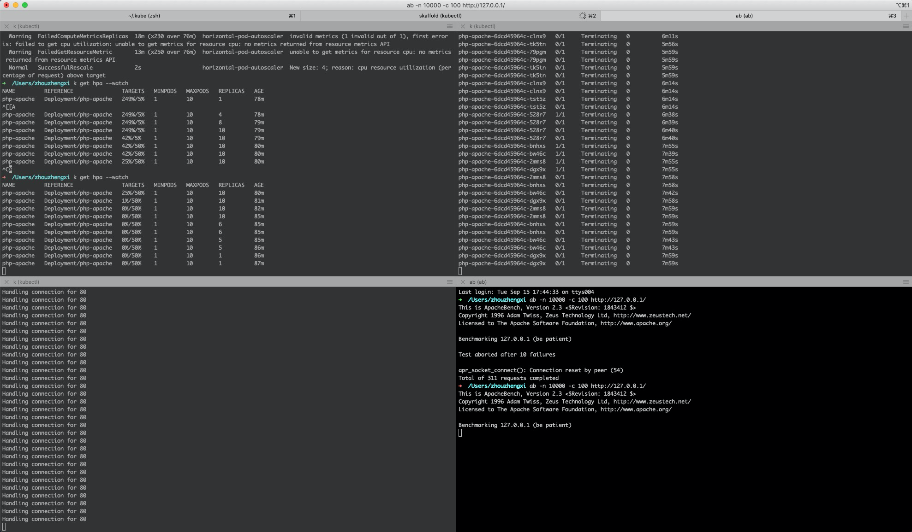

Try HPA with the power of Skaffold

The Poc is based on [horizontal-pod-autoscale-walkthrough](https://kubernetes.io/docs/tasks/run-application/horizontal-pod-autoscale-walkthrough/).

## Prerequisites
- [ ] [Metric server](https://github.com/kubernetes-sigs/metrics-server#deployment)
- [ ] [Skaffold](https://docs.google.com/document/d/1laX-XK1gyziTLQ_ZAbRVcw0rMv6e6ILDUixmaVu2h4E/edit)

In this [blog](https://www.replex.io/blog/kubernetes-in-production-the-ultimate-guide-to-monitoring-resource-metrics), it said:

>To get around this edit the metrics-server deployment config
kubectl edit deploy -n kube-system metrics-server
and add the following under .spec.template.spec.containers

>```
>command:
>- /metrics-server
>- --kubelet-insecure-tls
>```

So the deployed is revised as below.
```
spec:
  progressDeadlineSeconds: 600
  replicas: 1
  revisionHistoryLimit: 10
  selector:
    matchLabels:
      k8s-app: metrics-server
  strategy:
    rollingUpdate:
      maxSurge: 25%
      maxUnavailable: 25%
    type: RollingUpdate
  template:
    metadata:
      creationTimestamp: null
      labels:
        k8s-app: metrics-server
      name: metrics-server
    spec:
      containers:
      - args:
        - --cert-dir=/tmp
        - --secure-port=4443
        command:
        - /metrics-server
        - --kubelet-insecure-tls
        image: k8s.gcr.io/metrics-server/metrics-server:v0.3.7
        imagePullPolicy: IfNotPresent
        name: metrics-server
```

  To validate Metrics Service is working.
  ```
  ➜  /Users/zhouzhengxi k top nodes
  NAME                 CPU(cores)   CPU%   MEMORY(bytes)   MEMORY%
  kind-control-plane   759m         18%    1323Mi          66%

  ➜  /Users/zhouzhengxi k top pods
  NAME                                 CPU(cores)   MEMORY(bytes)
  a10-5d9946c968-6dmlb                 0m           0Mi
  a2-7c65bf6857-gb686                  0m           0Mi
  a2-7c65bf6857-h2g95                  0m           0Mi
  a3-7ddc7957db-cjvbv                  0m           0Mi
  a4-7c4c479fb6-qb97x                  0m           0Mi
  a5-77fb66f5c8-nncgh                  0m           0Mi
  a6-c848dd87d-pm88s                   0m           0Mi
  a7-5d74889c44-g2682                  0m           0Mi
  a8-755fb8d74b-wvbxj                  0m           0Mi
  a9-fc46c8595-kcd27                   0m           0Mi
  b1-655b5bb7fc-k2rd6                  0m           0Mi
  b1-655b5bb7fc-lf79w                  0m           0Mi
  b2-7c68686cfd-6qjg4                  0m           0Mi
  b2-7c68686cfd-w7tv9                  0m           0Mi
  c3-84bdff845b-ccpnn                  0m           0Mi
  component1-6fd47b8cf-2cnrs           0m           0Mi
  component2-6bdb4c8b85-zhc6j          0m           0Mi
  example-component-6fc66bb545-r7rb8   1m           4Mi
  label-nginx-5d85b5fb59-8pl8g         0m           0Mi
  label-nginx-5d85b5fb59-fj4qv         0m           0Mi
  label-nginx-5d85b5fb59-pks6t         0m           0Mi
  nginx-deployment-5d85b5fb59-6fk2k    0m           0Mi
  php-apache-6dcd45964c-vrztm          1m           7Mi
  rabbitmq-0                           89m          66Mi
  redis-server-master-0                12m          2Mi
  redis-server-slave-0                 11m          6Mi
  redis-server-slave-1                 8m           3Mi
  ```

Please also note:
>Passing these flags should only be considered as a work-around for test clusters. In production Kubernetes environments you should consider setting up the node's serving certificates to list the internal IP as an alternate name.

## Deploy application and HPA
  Generate [skaffold.yaml](./skaffold.yaml).
  ```
  ✗ skaffold init
  apiVersion: skaffold/v2beta7
  kind: Config
  metadata:
    name: cpu-utilization
  build:
    artifacts:
    - image: zzxwill/hpa-example
  deploy:
    kubectl:
      manifests:
      - autoscaler.yaml
      - php-apache.yaml
  
  Do you want to write this configuration to skaffold.yaml? [y/n]: y
  Configuration skaffold.yaml was written
  You can now run [skaffold build] to build the artifacts
  or [skaffold run] to build and deploy
  or [skaffold dev] to enter development mode, with auto-redeploy
  ```

  Deploy an application (svc/deployment) and HPA.
  ```
  $ skaffold dev
  WARN[0001] starting gRPC server on port 50052. (50051 is already in use)
  WARN[0001] starting gRPC HTTP server on port 50053. (50052 is already in use)
  Listing files to watch...
   - zzxwill/hpa-example
  Generating tags...
   - zzxwill/hpa-example -> zzxwill/hpa-example:latest
  Some taggers failed. Rerun with -vdebug for errors.
  Checking cache...
   - zzxwill/hpa-example: Found Locally
  Tags used in deployment:
   - zzxwill/hpa-example -> zzxwill/hpa-example:0ab0f9ffcd7518597050605c38b01139ed9c599475268fd94046502ac95bed40
  Loading images into kind cluster nodes...
   - zzxwill/hpa-example:0ab0f9ffcd7518597050605c38b01139ed9c599475268fd94046502ac95bed40 -> Loaded
  Images loaded in 5.208433409s
  Starting deploy...
   - horizontalpodautoscaler.autoscaling/php-apache created
   - deployment.apps/php-apache created
   - service/php-apache created
  Waiting for deployments to stabilize...
   - deployment/php-apache is ready.
  Deployments stabilized in 3.259462818s
  Press Ctrl+C to exit
  Watching for changes...
  [php-apache] AH00558: apache2: Could not reliably determine the server's fully qualified domain name, using 10.244.0.56. Set the 'ServerName' directive globally to suppress this message
  [php-apache] AH00558: apache2: Could not reliably determine the server's fully qualified domain name, using 10.244.0.56. Set the 'ServerName' directive globally to suppress this message
  [php-apache] [Tue Sep 15 11:34:46.310521 2020] [mpm_prefork:notice] [pid 1] AH00163: Apache/2.4.25 (Debian) PHP/5.6.40 configured -- resuming normal operations
  [php-apache] [Tue Sep 15 11:34:46.311495 2020] [core:notice] [pid 1] AH00094: Command line: 'apache2 -D FOREGROUND'
  ```

  Increase load.
  ```
  $ sudo k port-forward svc/php-apache 80
  $ ab -n 10000 -c 100 http://127.0.0.1/
  ```

  The replicas of the deployment scales from 1 to 10.
  
 
## Summary
  Skaffold is so cool. Running `skaffold dev` will help lively reload changes to all manifests.