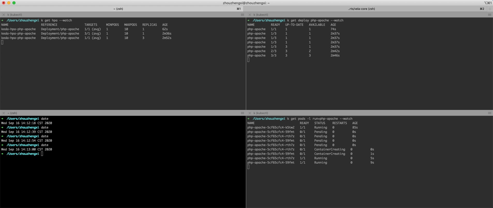

# Try KEDA Cron

The PoC is based on [KEDA Cron](https://keda.sh/docs/2.0/scalers/cron/).

## Prerequisites
- [ ] HPA
- [ ] [Skaffold](https://docs.google.com/document/d/1laX-XK1gyziTLQ_ZAbRVcw0rMv6e6ILDUixmaVu2h4E/edit)
- [ ] [KEDA](https://keda.sh/docs/2.0/deploy/)

## Deploy deployment and KEDA
  Generate [skaffold.yaml](skaffold.yaml). For more details, please refer to [Try HPA](../../try-hpa-with-skaffold/cpu-utilization/README.md).

  Deploy an application (deployment) and KEDA `ScaledObject` by `skaffold dev`.
  
  ```
  apiVersion: keda.k8s.io/v1alpha1
  kind: ScaledObject
  metadata:
    name: keda-scaler-poc
    namespace: default
    labels:
      deploymentName: php-apache
  spec:
    scaleTargetRef:
      deploymentName: php-apache
    pollingInterval: 15
    cooldownPeriod:  30
    minReplicaCount: 1
    maxReplicaCount: 10
    triggers:
      - type: cron
        metadata:
          # Required
          timezone: Asia/Shanghai # The acceptable values would be a value from the IANA Time Zone Database.
          start: 13 * * * *       # Every hour on the 30th minute
          end: 30 * * * *         # Every hour on the 45th minute
          desiredReplicas: "3"    # String.
  ```

  Keda will scale the deployment every hour on the 13th minute.

  The replicas of the deployment scales from 1 to 3 at 16:13.
  
